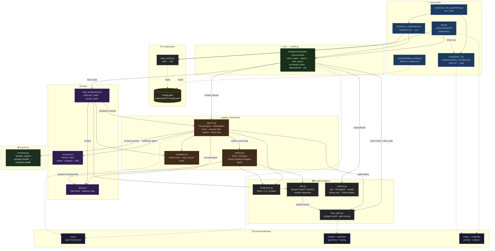
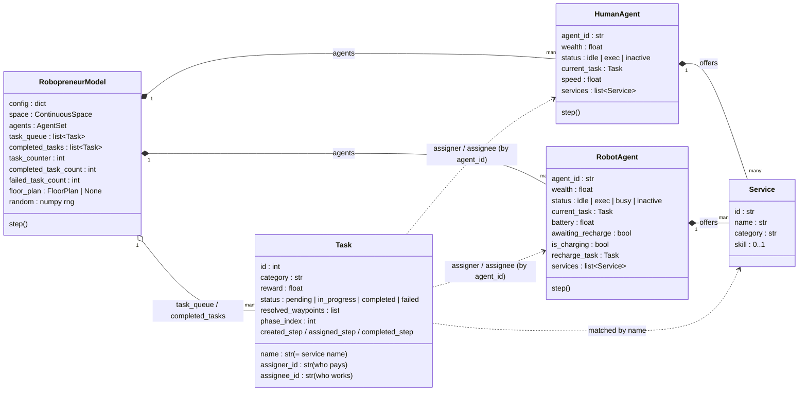

```mermaid
flowchart TD

  %% ── colour palette (same as flow-diagram.md) ────────────────────
  classDef entry   fill:#1e3a5f,stroke:#3b82f6,color:#bfdbfe
  classDef core    fill:#1a2e1a,stroke:#22c55e,color:#bbf7d0
  classDef agent   fill:#3f2c1c,stroke:#fb923c,color:#fed7aa
  classDef task    fill:#2d1f4e,stroke:#a855f7,color:#e9d5ff
  classDef economy fill:#1f2e1f,stroke:#4ade80,color:#dcfce7
  classDef util    fill:#252525,stroke:#94a3b8,color:#e2e8f0
  classDef data    fill:#2a2a1e,stroke:#eab308,color:#fef9c3
  classDef ext     fill:#1a1a2e,stroke:#818cf8,color:#c7d2fe

  %% ═══════════════════════════════════════════════════════════════
  %% ENTRY POINTS — how a human starts a run
  %% ═══════════════════════════════════════════════════════════════
  subgraph ENTRY["🚪  entry points"]
    direction LR
    APP["app.py\nsolara dashboard\n(interactive)"]:::entry
    RUN["scripts/run_experiment.py\nheadless run → csv"]:::entry
    FULL["scripts/run_full_experiment.py\nrun + plot"]:::entry
    VAL["scripts/validate_config.py\nchecks a config.yaml"]:::entry
    PLOT["scripts/plot_*.py\nscripts/compare_scenarios.py\nread csv → png"]:::entry
  end

  %% ═══════════════════════════════════════════════════════════════
  %% CONFIG
  %% ═══════════════════════════════════════════════════════════════
  subgraph CONFIG["⚙️  configuration"]
    direction LR
    YAML[("config.yaml\nexperiments/**/config.yaml")]:::data
    LOAD["load_config.py\nyaml → dict"]:::util
  end

  %% ═══════════════════════════════════════════════════════════════
  %% CORE MODEL
  %% ═══════════════════════════════════════════════════════════════
  subgraph CORE["🧠  core  —  model.py"]
    MODEL["RobopreneurModel (mesa.Model)\nowns: space · agents · task_queue\ncompleted_tasks · datacollector · rng"]:::core
  end

  %% ═══════════════════════════════════════════════════════════════
  %% BEHAVIOUR
  %% ═══════════════════════════════════════════════════════════════
  subgraph BEHAVIOUR["🤖  agents & behaviour"]
    direction TB
    AGENTS["agents.py\nHumanAgent · RobotAgent\nmove · execute task phases · finish task"]:::agent
    BATT["battery.py\ndrain / recharge\ncreates BatteryCharging tasks"]:::agent
    SCHED["schedule.py\nactive hours · day / minute clock"]:::agent
  end

  subgraph TASKS["📋  tasks"]
    direction TB
    TA["task_assignation.py\ngenerate_tasks · assign_tasks"]:::task
    TASKPY["tasks.py\nTask class · requeue_task"]:::task
    SERV["services.py\nService class\n(name · category · skill)"]:::task
  end

  subgraph ECON["💰  economy"]
    ECO["economy.py\ntransfer_reward\nassigner.wealth → assignee.wealth"]:::economy
  end

  %% ═══════════════════════════════════════════════════════════════
  %% WORLD + HELPERS
  %% ═══════════════════════════════════════════════════════════════
  subgraph WORLD["🗺️  world & helpers"]
    direction LR
    FP["floor_plan.py\npolygon world · path routing"]:::util
    MOV["movement.py\ncheck_if_at_location"]:::util
    UTIL["utils.py\nsample reward / duration\nresolve waypoints"]:::util
    MET["metrics.py\ngini · throughput · wealth\nqueue size · critical battery"]:::util
  end

  %% ═══════════════════════════════════════════════════════════════
  %% EXTERNAL LIBS
  %% ═══════════════════════════════════════════════════════════════
  subgraph EXT["📦  external libraries"]
    direction LR
    MESA["mesa\nagent framework"]:::ext
    SHAPELY["shapely + jupedsim\ngeometry + routing"]:::ext
    SOLARA["solara · matplotlib\npandas · seaborn"]:::ext
  end

  %% ── entry points ────────────────────────────────────────────────
  APP --> LOAD
  APP --> MODEL
  RUN --> LOAD
  RUN --> MODEL
  FULL --> RUN
  FULL --> PLOT
  VAL -.->|reads| YAML
  RUN -.->|writes csv| PLOT
  LOAD -.->|reads| YAML

  %% ── model wiring ────────────────────────────────────────────────
  MODEL -->|creates agents| AGENTS
  MODEL -->|every step| TA
  MODEL -->|world.mode = floor_plan| FP
  MODEL -->|datacollector| MET

  %% ── agents ──────────────────────────────────────────────────────
  AGENTS -->|builds per agent| SERV
  AGENTS -->|robots, every step| BATT
  AGENTS --> SCHED
  AGENTS --> MOV
  AGENTS -->|on task success| ECO
  AGENTS -->|on interruption| TASKPY
  AGENTS -->|path finding| FP

  %% ── tasks ───────────────────────────────────────────────────────
  TA -->|creates| TASKPY
  TA --> UTIL
  TA --> SCHED
  TA -->|isinstance checks| AGENTS

  %% ── battery ─────────────────────────────────────────────────────
  BATT -->|creates recharge task| TASKPY
  BATT --> UTIL
  BATT --> MOV

  %% ── helpers ─────────────────────────────────────────────────────
  UTIL -->|random points| FP

  %% ── external ────────────────────────────────────────────────────
  MODEL -.-> MESA
  AGENTS -.-> MESA
  FP -.-> SHAPELY
  APP -.-> SOLARA
  PLOT -.-> SOLARA
```

```mermaid
classDiagram
  direction LR

  class RobopreneurModel {
    config : dict
    space : ContinuousSpace
    agents : AgentSet
    task_queue : list~Task~
    completed_tasks : list~Task~
    task_counter : int
    completed_task_count : int
    failed_task_count : int
    floor_plan : FloorPlan | None
    random : numpy rng
    step()
  }

  class HumanAgent {
    agent_id : str
    wealth : float
    status : idle | exec | inactive
    current_task : Task
    speed : float
    services : list~Service~
    step()
  }

  class RobotAgent {
    agent_id : str
    wealth : float
    status : idle | exec | busy | inactive
    current_task : Task
    battery : float
    awaiting_recharge : bool
    is_charging : bool
    recharge_task : Task
    services : list~Service~
    step()
  }

  class Service {
    id : str
    name : str
    category : str
    skill : 0..1
  }

  class Task {
    id : int
    name : str  (= service name)
    category : str
    assigner_id : str  (who pays)
    assignee_id : str  (who works)
    reward : float
    status : pending | in_progress | completed | failed
    resolved_waypoints : list
    phase_index : int
    created_step / assigned_step / completed_step
  }

  RobopreneurModel "1" *-- "many" HumanAgent : agents
  RobopreneurModel "1" *-- "many" RobotAgent : agents
  RobopreneurModel "1" o-- "many" Task : task_queue / completed_tasks
  HumanAgent "1" *-- "many" Service : offers
  RobotAgent "1" *-- "many" Service : offers
  Task ..> HumanAgent : assigner / assignee (by agent_id)
  Task ..> RobotAgent : assigner / assignee (by agent_id)
  Task ..> Service : matched by name
```