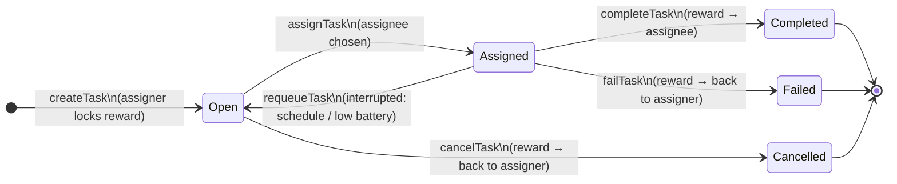

# Blockchain & Web3 functionalities

What the blockchain layer will do inside the simulator, concept by concept, and why each
decision was made. Written for someone new to blockchain.

---

## 0 · Blockchain in 2 minutes

| Term | Plain meaning | In our simulator |
| --- | --- | --- |
| **Blockchain / ledger** | A shared notebook of every money movement and important action. Pages can only be added, never edited or torn out. | Replaces the floating `wealth` numbers with a history everyone can check. |
| **Block** | One page of that notebook — a batch of actions recorded together. | **One block = one simulation step** (1 minute). |
| **Wallet** | An account: an *address* (like an IBAN, public) + a *private key* (like a PIN, secret, used to sign). | Every human and robot gets one. |
| **Token** | The money that lives on the chain. | `IEC` — the currency already used in `config.yaml` (`initial_wealth: 2000 # IEC`). |
| **Transaction** | A signed request to change something on the chain ("send 120 IEC to X", "create task"). | Every money move or task state change. |
| **Smart contract** | A small program stored on the chain. Nobody can change its rules once deployed, and it can hold money itself. | The rules of our marketplace: registries + task escrow. |
| **Escrow** | Money parked with a neutral third party until a job is done. | The contract holds the reward while a task is in progress. |
| **Event** | A public announcement a contract makes ("task 42 completed"). Cheap to emit, easy to listen to. | Feeds metrics, dashboard and CSV logs. |
| **Gas** | The fee paid to the network for running a transaction. | Tracked, optionally charged (see decision D6). |
| **Oracle** | Someone who tells the chain about the real world. The chain can't "see" if a robot actually cleaned the lab. | The simulator itself reports task outcomes. |
| **On-chain / off-chain** | Stored on the blockchain vs. stored in normal program memory. | Money + agreements on-chain; movement, battery, physics off-chain. |

---

## 1 · The big picture

Today, the economy of the simulator is one function:

```python
# economy.py
assigner.wealth -= task.reward
assignee.wealth += task.reward
```

It runs only when a task succeeds, it doesn't check whether the assigner can pay, and
nothing remembers that it happened.

With the blockchain layer, the economy becomes a **small, rule-bound marketplace**:

1. Every agent has a **wallet** holding **IEC tokens**.
2. Agents **register** on-chain, and so do the **services** they offer.
3. When someone needs a task done, they **lock the reward in escrow** at creation.
4. When the task finishes, the contract **pays the worker** (success) or **refunds the
   requester** (failure).
5. Every step of this is a **transaction**, and each produces **events** we can analyse.

**What stays exactly as it is:** movement, floor plan, battery physics, schedules, phases
and waypoints, failure probability, and the matching logic of *who* gets a task. The
blockchain records and enforces the *economic agreements*; it does not run the robots.

> **Why this split?** On a real blockchain, every computation costs gas and every byte stored
> is expensive. Running path-finding or battery drain on-chain would be absurdly costly and
> slow. Real-world projects (robot fleets, delivery networks) do exactly this: physical
> operations off-chain, payments and agreements on-chain.

---

## 2 · The six concepts

### 2.1 Agent

**What it is today:** a `HumanAgent` or `RobotAgent` object with an `agent_id` string
(`robot_1_0`) and a `wealth` float.

**What it becomes:** the same Python object, plus an **on-chain identity**.

| On-chain (AgentRegistry contract) | Off-chain (stays in `agents.py`) |
| --- | --- |
| wallet address | position, speed, target location |
| `agent_id` (`robot_1_0`) | battery, charging state |
| agent kind: `human` / `robot` | schedule, status (`idle`/`exec`/…) |
| registration step | current task phase / dwell timer |
| `active` flag | random walk counters |

**Functionalities**
- `registerAgent(agent_id, kind)` — called once at initialization, from the agent's wallet.
- `isRegistered(address)` — contracts check this before letting anyone create or take tasks.
- `deactivate(address)` — optional, for later (an agent leaves the market).

> **Why register agents at all?** So the contracts can refuse actions from unknown
> addresses. It's the "membership list" of the marketplace. It also lets us tell humans and
> robots apart on-chain (useful for metrics like *how much money flows robot → human*).

---

### 2.2 Wallet

**What it is today:** doesn't exist — `wealth` is a plain number on the agent.

**What it becomes:** a `Wallet` object attached to every agent.

```
Wallet
  address       – public, unique (e.g. 0x3f…a1)
  private_key   – secret, used to sign transactions (only the agent knows it)
  balance()     – reads IEC balance from the token contract (not stored locally!)
  nonce         – counter of transactions sent (prevents replaying the same tx twice)
```

**Functionalities**
- **Create** one wallet per agent at initialization.
- **Fund** it: the token contract mints `initial_wealth` IEC into each wallet.
- **Sign and send** transactions on behalf of the agent.
- **Read balance** — `agent.wealth` becomes a read of the wallet balance, so `metrics.py`
  (Gini, system wealth) keeps working unchanged.

> **Why is balance read from the chain and not stored on the agent?** Single source of truth.
> If the agent kept its own copy, the two could drift apart. On a blockchain, the
> balance *is* whatever the ledger says.

> **Why one wallet per agent and not per agent type?** Each robot earns and spends
> independently — that's the whole point of a "robopreneur". Wealth inequality (Gini) is
> measured per agent, so the wallet must be per agent too.

---

### 2.3 Servicio (Service)

**What it is today:** each agent holds a private list of `Service(name, category, skill)`.
To find who can do a task, `_get_eligible_agents` loops over every agent.

**What it becomes:** a public **ServiceRegistry** — a catalogue of *who offers what*.

| Stored on-chain per offer | Example |
| --- | --- |
| provider address | `0x3f…a1` (robot_1_0) |
| service name | `LabCleaning` |
| category | `cleaning` |
| skill (0–1, stored as integer 0–1000) | `950` |
| active | `true` |

The service *definitions* (reward median, phases, waypoints, durations) stay in
`config.yaml` — they describe the physical job, not the agreement.

**Functionalities**
- `registerService(name, category, skill)` — each agent registers each service it offers at
  init.
- `getProviders(name)` — list of addresses offering a service. The off-chain matcher reads
  this, then filters by the off-chain conditions (idle, battery, schedule).
- `deactivateService(name)` — optional, for later (e.g. a robot stops offering a service).

> **Why store skill as an integer?** Blockchains (Solidity) have no decimal numbers. The
> standard trick is to scale: `0.95 → 950`.

> **Why a registry instead of each agent's list?** It's the "yellow pages" of the
> marketplace — anyone can check who offers what, and a task can only be assigned to an
> address that actually registered that service. That check is enforced by the contract,
> not just trusted from Python.

---

### 2.4 Tarea (Task)

**What it is today:** a `Task` object with lifecycle `pending → in_progress →
completed | failed`, and the reward is paid only at the end, without checking funds.

**What it becomes:** a **job agreement** inside a **TaskEscrow** contract. The Python `Task`
object still exists (it holds waypoints, phase timers etc.) and gets a `chain_task_id`
linking it to its on-chain twin.



| On-chain (TaskEscrow) | Off-chain (Python `Task`) |
| --- | --- |
| chain task id | resolved waypoints, phase index, dwell timers |
| assigner address, assignee address | location, durations |
| service name | agent skill used for fail roll |
| reward amount (locked) | |
| status | |
| created / assigned / closed block | |

**Functionalities**
- `createTask(service, reward)` — sent by the **assigner**. Moves `reward` IEC from the
  assigner's wallet into the contract. **Fails if the assigner can't afford it.**
- `assignTask(taskId, assignee)` — sent by the **operator** (see D3). Checks the assignee is
  registered and offers that service.
- `requeueTask(taskId)` — operator; back to `Open`, money stays locked.
- `completeTask(taskId)` — operator (oracle); releases the reward to the assignee.
- `failTask(taskId)` — operator (oracle); refunds the assigner.
- `cancelTask(taskId)` — assigner; only while `Open`, full refund. (Not used by the sim at
  first, but a real marketplace needs it.)

> **Why lock the money at creation (escrow)?** It solves two problems of the current model:
> (1) the assigner can no longer go into negative wealth, and (2) the worker knows the
> money is guaranteed before starting. This is the classic use-case of smart contracts.

---

### 2.5 Transaction

**What it is today:** doesn't exist.

**What it becomes:** every action that changes on-chain state is a transaction, and the
simulator keeps the full list.

```
Transaction
  tx_hash       – unique id
  block         – simulation step in which it was included
  sender        – wallet address that signed it
  contract      – Token / AgentRegistry / ServiceRegistry / TaskEscrow
  function      – e.g. createTask
  args          – e.g. {service: "LabCleaning", reward: 140}
  value_moved   – IEC moved (0 if none)
  gas_used      – cost estimate
  status        – success / reverted (+ reason, e.g. "insufficient balance")
```

**Transaction types in the simulator**

| Transaction | Sender | Moves money? | When |
| --- | --- | --- | --- |
| `mint` (initial funding) | operator | yes → agent | init |
| `registerAgent` | agent | no | init |
| `registerService` | agent | no | init |
| `createTask` | assigner | yes → escrow | task generated / robot needs recharge |
| `assignTask` | operator | no | `assign_tasks()` |
| `requeueTask` | operator | no | schedule or battery interruption |
| `completeTask` | operator | yes escrow → assignee | `_finish_task(success=True)` |
| `failTask` | operator | yes escrow → assigner | `_finish_task(success=False)` |

**Functionalities**
- Send, sign, include in the current block.
- **Revert** cleanly: if a rule is broken (not enough IEC, not registered…), the transaction
  is rejected and nothing changes. The simulator must handle this (e.g. task is not created).
- Export to `transactions.csv` alongside the existing CSVs.

> **What does "revert" mean?** All-or-nothing. If any check fails halfway, the whole
> transaction is undone as if it never happened. That's why money can never be "half
> transferred".

---

### 2.6 Event

**What it is today:** doesn't exist (the closest thing is the `task.created_step` /
`assigned_step` / `completed_step` fields).

**What it becomes:** contracts emit an event for every meaningful thing that happens.

| Event | Emitted by | Fields |
| --- | --- | --- |
| `Transfer` | Token | from, to, amount |
| `AgentRegistered` | AgentRegistry | address, agent_id, kind |
| `ServiceRegistered` | ServiceRegistry | provider, service, skill |
| `TaskCreated` | TaskEscrow | taskId, assigner, service, reward |
| `TaskAssigned` | TaskEscrow | taskId, assignee |
| `TaskRequeued` | TaskEscrow | taskId, previous assignee |
| `TaskCompleted` | TaskEscrow | taskId, assignee, reward |
| `TaskFailed` | TaskEscrow | taskId, assignee, refunded amount |

**Functionalities**
- **Logging** → `events.csv`: a full, ordered history of the market.
- **Metrics** → new reporters can be computed from events (money locked in escrow, payment
  flow robot→human, rejected tasks for lack of funds…).
- **Dashboard** → the Solara app can show a live event feed.

> **Transaction vs event — what's the difference?** A transaction is the *request*
> ("please complete task 42"). An event is the *announcement of the result* ("task 42
> completed, 140 IEC paid to robot_1_0"). One transaction can emit several events
> (e.g. `completeTask` emits `TaskCompleted` + `Transfer`).

---

## 3 · Smart contracts

Four contracts, each with one job:

| Contract | Job | Concepts it covers |
| --- | --- | --- |
| **IECToken** | The currency. Balances, transfers, minting at init. (Standard "ERC-20" token.) | Wallet, Transaction |
| **AgentRegistry** | Who is a member of the marketplace. | Agent |
| **ServiceRegistry** | Who offers which service, with what skill. | Servicio |
| **TaskEscrow** | Task agreements + holds and releases the money. | Tarea, Transaction, Event |

> **Why split into four and not one big contract?** Each is small, easy to read, easy to
> test. The token is a well-known standard (ERC-20), so we don't reinvent it.

---

## 4 · Design decisions

**D1 · Mock chain first, real chain second.**
We define one Python interface (`createTask`, `completeTask`, `balanceOf`, …) with two
backends:
- **MockChain** — pure Python, in memory. Follows exactly the same rules, transactions and
  events. Fast and deterministic → used for experiments with 10 000 steps.
- **EVM backend** — real Solidity contracts on a local test blockchain (Anvil), called via
  `web3.py`. Slower, but it's a real blockchain → used for demos and to prove it works.

*Why:* a real local chain adds ~milliseconds per transaction and thousands of transactions
per run; experiments would become slow and harder to reproduce. Starting with the mock lets
us design and test the rules quickly, then "swap the engine".
A config flag picks the backend: `blockchain: {enabled: true, backend: mock | evm}`, and
`enabled: false` keeps the simulator exactly as it is today.

**D2 · One block per simulation step.**
All transactions from one `model.step()` go into the same block. Simple to reason about
and lines up with existing `*_step` fields.

**D3 · The simulator is the operator and the oracle.**
The model has its own wallet (the "operator"). It is the only address allowed to call
`assignTask`, `completeTask`, `failTask`, `requeueTask`.
*Why:* the chain can't see the physical world, so someone trusted must report outcomes.
In a real deployment this could be replaced by sensors, the assigner confirming, or a
vote — but that's a later research question, not needed now.

**D4 · Matching stays off-chain.**
`assign_tasks()` still decides *who* gets the task (random among eligible). The contract
only checks the choice is valid (registered, offers the service).
*Why:* eligibility depends on battery, schedule and idle status, which live off-chain.

**D5 · Reward is sampled at task creation (not assignment).**
Escrow needs the amount up front.
*Consequence:* moving the sampling changes the order of random draws, so a run with the
same seed would no longer reproduce old results.
**Recommendation:** only sample at creation when blockchain is enabled, so existing
experiments stay reproducible with `enabled: false`.

**D6 · Gas is tracked, not charged (at first).**
Each transaction records an estimated gas cost, but no IEC is deducted.
*Why:* charging fees changes the economy (wealth slowly leaks out of the system), which is
an interesting experiment on its own — so it should be a switch (`charge_gas: false`), not
a default.

**D7 · Tasks the assigner can't afford are rejected.**
`createTask` reverts, the task never enters the queue, and we count it in a new metric
`Rejected_Tasks`.
⚠️ This includes **robots that can't afford a recharge** — a broke robot would be stuck.
Options: (a) let it happen (it's a real economic risk — interesting result), (b) give
`BatteryCharging` a reserved budget, (c) allow recharge on credit. **Open question for you.**

**D8 · Failed tasks refund the assigner.**
Same behaviour as today (no one gets paid on failure), but now explicit and logged.

---

## 5 · Example: one task, end to end

`robot_1_0` needs its battery charged, `human_2_0` does it. Reward = 120 IEC.

| Step | What happens in the sim | Transaction | Events | Balances (robot / escrow / human) |
| --- | --- | --- | --- | --- |
| 0 | init | `mint` ×2, `registerAgent` ×2, `registerService` ×… | `Transfer`, `AgentRegistered`, `ServiceRegistered` | 2000 / 0 / 2000 |
| 350 | battery ≤ 30 → recharge task | `createTask(BatteryCharging, 120)` from robot | `TaskCreated`, `Transfer(robot→escrow)` | 1880 / 120 / 2000 |
| 351 | `assign_tasks()` picks human_2_0 | `assignTask(7, human_2_0)` from operator | `TaskAssigned` | 1880 / 120 / 2000 |
| 351–370 | human walks, plugs in, dwells | — (off-chain) | — | unchanged |
| 371 | phase done, success | `completeTask(7)` from operator | `TaskCompleted`, `Transfer(escrow→human)` | 1880 / 0 / 2120 |

---

## 6 · What changes in the code (preview)

| File | Change |
| --- | --- |
| new `blockchain/` package | `wallet.py`, `chain.py` (interface), `mock_chain.py`, later `evm_chain.py` + `contracts/*.sol` |
| `model.py` | create chain + operator wallet; one block per step |
| `agents.py` | each agent gets a `wallet`; `wealth` reads the balance; `_finish_task` calls complete/fail |
| `services.py` | services registered in the registry at init |
| `task_assignation.py` | `createTask` on generation (handle revert); `assignTask` on assignment |
| `battery.py` | recharge task goes through `createTask`; `requeue` goes through `requeueTask` |
| `economy.py` | `transfer_reward` replaced by escrow release (kept for `enabled: false`) |
| `metrics.py` | new reporters: escrow locked, rejected tasks, tx count, gas |
| `scripts/run_experiment.py` | also writes `transactions.csv`, `events.csv` |
| `config.yaml` | new `blockchain:` section |
